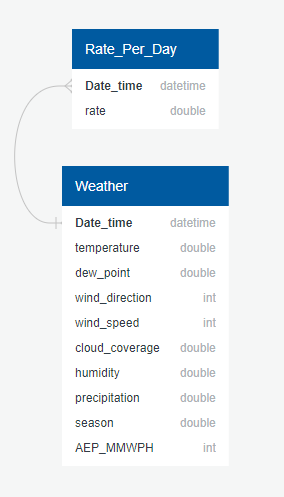

# Hourly-Energy-Consumption

## Table of Contents
- [Project Overview](#ProjectOverview)
  * [What is our Topic?](#WhatTopic)
  * [Why Energy Consumption?](#WhyEnergyConsumption)
  * [What questions are we hoping to answer?](#Questions)
  * [Description of Source Data](#DescriptionOfSourceData)
  * [Approach?](#Approach)
- [Database](#Database)
  * [Schema](#DBSchema)
  * [Preprocessing of Data](#Preprocessing)
- [Analysis & Visualizations](#Analysis)
- [Machine Learning Models](#MachineLearningModel)
- [Technologies](#Technologies)
- [Communication Protocols](#CommunicationProtocols)
- [Resources](#Resources)

##  Project Overview

###  What is our Topic? 
Our topic is energy consumption.

###  Why Energy Consumption?
According to un.org, The world’s population is projected to reach 8 billion on November 15th, 2022.  The latest projections by the United Nations suggest that the global population could grow to around 8.5 billion in 2030, 9.7 billion in 2050, and 10.4 billion in 2100.  As our population increases so do our energy needs.  Those rising energy needs will not only influence our lives but will also affect the lives of our children.  Climate change, energy shortages, and increased energy costs are just scratching the surface of the impact.  To aid in kickstarting the conversation, we would like to build a model predicting the total amount of energy consumption and the rate of energy consumption, for a particular region.  We hope that our model may spark a desire for people to lead a more energy-efficient life.

###  Questions we hope to answer with Data
* Can we build a model to predict energy consumption for the following year?
* Can we identify any trends in energy consumption?

###  Description of our Source Data

###  Approach:

##  Database

###  Schema

###  Preprocessing of Data
* Add season and time of day attributes to the data for additional analysis 

##  Analysis & Visualizations

##  Machine Learning Models
We are using a superivised model because we are using labled data. More specfically, our model will be multiple linear regression because we are predicting energy consumption in megawatts using multiple independent variables. Our target variable will be megawatts used per hour. Our features will be tempearture,cloud cover,humidity,precipitation,dew point,season,wind speed,and wind direction. 

##  Technologies

We used the below technologies while completing this project:

- Tableau
- React
- Python
- SQL - PostGres DB
- API's

##  Communication Protocols

**Slack** – A messaging tool we used to coordinate meetings, send links and data  
**Microsoft Teams/Zoom** – We held meetings using Microsoft Teams and Zoom platforms  
**GitHub** – We utilized GitHub for Version management and collaboration.  

##  Resources

[1] **Data Files:**  
- [Kaggle DataFiles](Resources/DataFiles)  

[2] **API's:**  
- [The U.S. Energy Information Administration API](https://www.eia.gov/opendata/)
- [Open Weather API](https://openweathermap.org/api)  
