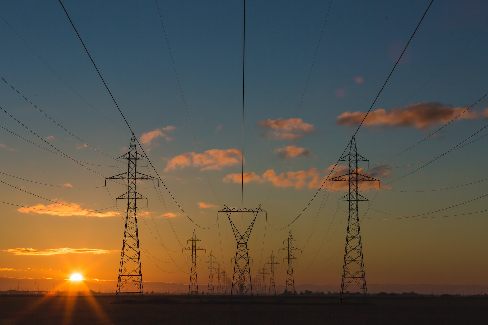
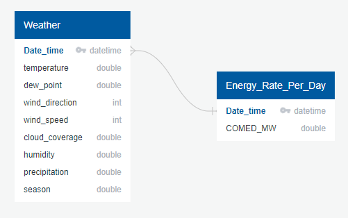

# Hourly-Energy-Consumption

## Table of Contents
- [Project Overview](#ProjectOverview)
  * [What is our Topic?](#WhatTopic)
  * [Why Energy Consumption?](#WhyEnergyConsumption)
  * [What questions are we hoping to answer?](#Questions)
  * [Description of Source Data](#DescriptionOfSourceData)
  * [Approach?](#Approach)
- [Database](#Database)
  * [Schema](#DBSchema)
  * [Preprocessing of Data](#Preprocessing)
- [Analysis & Visualizations](#Analysis)
- [Machine Learning Models](#MachineLearningModel)
- [Technologies](#Technologies)
- [Communication Protocols](#CommunicationProtocols)
- [Resources](#Resources)

##  Project Overview

###  What is our Topic? 
Our topic is energy consumption.

###  Why Energy Consumption?
According to un.org, The world’s population is projected to reach 8 billion on November 15th, 2022.  The latest projections by the United Nations suggest that the global population could grow to around 8.5 billion in 2030, 9.7 billion in 2050, and 10.4 billion in 2100.  As our population increases so do our energy needs.  Those rising energy needs will not only influence our lives but will also affect the lives of our children.  Climate change, energy shortages, and increased energy costs are just scratching the surface of the impact.  To aid in kickstarting the conversation, we would like to build a model predicting the total amount of energy consumption and the rate of energy consumption, for a particular region.  We hope that our model may spark a desire for people to lead a more energy-efficient life.

###  Questions we hope to answer with Data
* Can we build a model to predict energy consumption for the following year?
* Can we identify any trends in energy consumption?

###  Description of our Source Data
We are using a data set from Kaggle which contains Date Time and Mega Watts of energy consumed to seed our database.  This data set spans from 2004-2018.  The original source for the energy consumption data is from the EIA.gov open data API, which has more recent readings of the data. For data after 2018, we are using the EIA.gov API.  We will also use population and regional temperature data gathered from Visual Crossings and Open Weather API's.

###  Approach:
We're going to pull the data in a CSV format into a database table. Later append the API sourced additional consumption readings.

##  Database

###  Schema

###  Preprocessing of Data for EDA & Machine Learning Model
* There were 4 repeated datetimes with 2 different energy comsumption rates. As a result we replaced the energy consumption value of duplicated datetimes with the mean energy consumption. 
* In the dataset, we found 11 missing values in the COMED_MW columns. To fill these missing values we use mean interpolation.
* Seasonality  was tested using the seasonal decomposition function 
* Stationarity was tested using the Augmented Dickey-Fuller test. This test comfirmed our data is stationary. 
* The original datatime column was used to create several other date columns to depict daily and weekly trends. 
* ACF and PACF plots were made to try to find the optimal autoregressive and moving average variables for the model

##  Analysis & Visualizations
The exploration of the data showed various aspects of the data.
  1.  There is a cyclical pattern annually of usage with each year the peak beginning or around the 200th day of the year. This seasonality will need to be factored out to for the machine learning model. The seasonality revolves around the the usage patterns during the hottest period of the year.
  https://github.com/jovansgit/Hourly-Energy-Consumption/blob/main/images/time_series_week_plot.png
  https://github.com/jovansgit/Hourly-Energy-Consumption/blob/main/images/seasonal_subplots.png
  2.  The histogram of the overall dataset 
  https://github.com/jovansgit/Hourly-Energy-Consumption/blob/main/images/histogram.png
  3.  Usage patterns by day and hour 
  https://github.com/jovansgit/Hourly-Energy-Consumption/blob/main/images/boxplots.png

##  Machine Learning Models
 The machine learning model we have chosen is SARIMAX. We have chosen this model because it can handle seasonality and energy comsumption is seasonal by nature. We have proven that this dataset shows seasonality in our exploritory analysis. Not only does this model bring in variables for seasonality, it can also take exogenous variables which could be helpful if we want to bring in other varaibles relating to weather. 
 
 Our data was broken into a traning set from January 1st 2014 to December 21st 2016. Our testing set was from January 1st 2017 to January 1st 2018. We chose to omit any data prior to 2014 in an effort to train our model with the most recent data. This is important for an energy consumption model as household techonolgy has increased over the years and thus energy consumption would increase as well.Since we are trying to predict the values from 2019 data from anything prior to 2014 could have significanlty lower energy consumption rates. 
##  Technologies

We used the below technologies while completing this project:

- Tableau
- React
- Python
- SQL - PostGres DB
- API's

##  Communication Protocols

**Slack** – A messaging tool we used to coordinate meetings, send links and data  
**Microsoft Teams/Zoom** – We held meetings using Microsoft Teams and Zoom platforms  
**GitHub** – We utilized GitHub for Version management and collaboration.  

##  Resources

[1] **Data Files:**  
- [Kaggle DataFiles](Resources/DataFiles)  

[2] **API's:**  
- [The U.S. Energy Information Administration API](https://www.eia.gov/opendata/)
- [Open Weather API](https://openweathermap.org/api)  
- [Visual Crossing Weather API](https://www.visualcrossing.com/weather-api)  
- [US Census Population Data](https://www.census.gov/data/developers/data-sets/popest-popproj/popest.html)  
